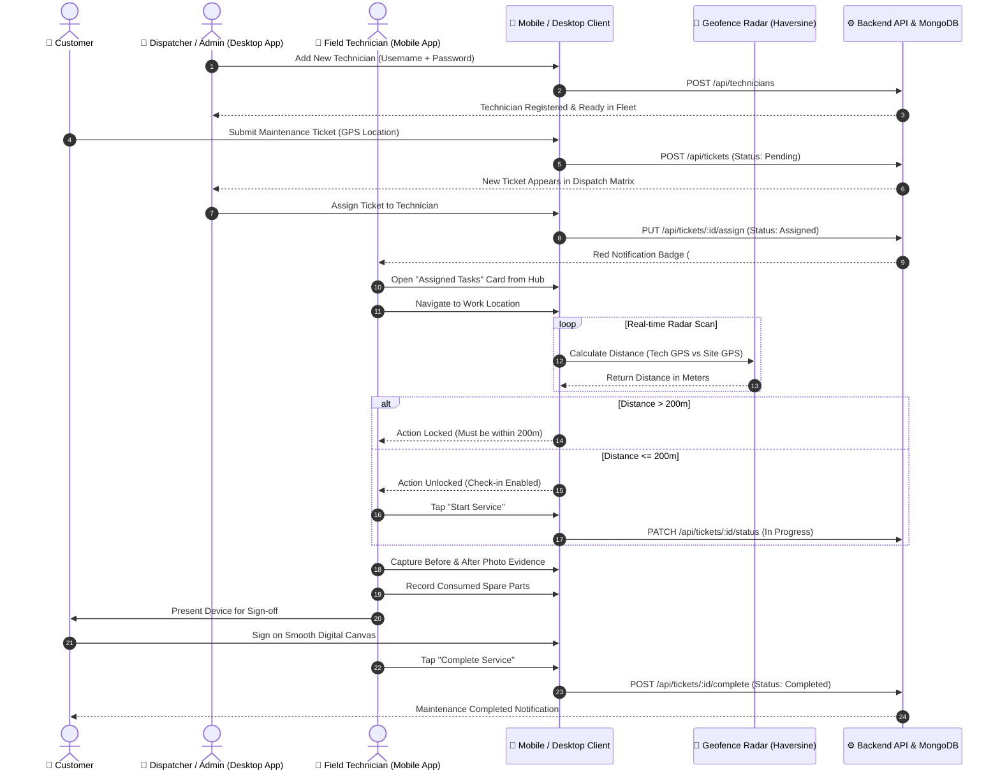

# FieldOps Nexus — Enterprise Field Service & Maintenance Platform (v1.1.0)

[](https://github.com/ZillerDX/field-service-platform/actions/workflows/deploy-pages.yml)
[](https://github.com/ZillerDX/field-service-platform/actions/workflows/flutter-release.yml)


FieldOps Nexus is an enterprise-grade Field Service & Maintenance management platform engineered for real-time dispatching, automated GPS geofencing, multi-role field workflow orchestration, native Windows Desktop operations, and offline-first mobile field operations.

---

## 🌐 Live Demos & Direct Downloads

| Platform | Architecture / Channel | Direct Download / Access Link |
| :--- | :--- | :--- |
| **PWA Web Client (Live)** | GitHub Pages Production | 👉 [**https://zillerdx.github.io/field-service-platform/**](https://zillerdx.github.io/field-service-platform/) |
| **Windows Desktop Admin App** | Windows x64 Native Portable Zip | 💻 [**Download `FieldOps-Nexus-Admin-Windows-x64-v1.1.0.zip` (11.8 MB)**](https://github.com/ZillerDX/field-service-platform/releases/download/v1.1.0/FieldOps-Nexus-Admin-Windows-x64-v1.1.0.zip) |
| **Android Production App (ARM64)** | `arm64-v8a` (Modern Phones - Recommended) | 📲 [**Download `app-arm64-v8a-release.apk` (17.3 MB)**](https://github.com/ZillerDX/field-service-platform/releases/download/v1.1.0/app-arm64-v8a-release.apk) |
| **Android Legacy App (ARM32)** | `armeabi-v7a` (Older Android Devices) | 📲 [**Download `app-armeabi-v7a-release.apk` (14.9 MB)**](https://github.com/ZillerDX/field-service-platform/releases/download/v1.1.0/app-armeabi-v7a-release.apk) |
| **Android Emulator (x86_64)** | `x86_64` (Android Studio / ChromeOS) | 📲 [**Download `app-x86_64-release.apk` (18.5 MB)**](https://github.com/ZillerDX/field-service-platform/releases/download/v1.1.0/app-x86_64-release.apk) |
| **GitHub Release v1.1.0** | Full Release Package & Notes | 📦 [**View GitHub Release v1.1.0**](https://github.com/ZillerDX/field-service-platform/releases/tag/v1.1.0) |
| **Backend API Gateway** | Local Docker Compose | `http://localhost:5001/api` |

---

## ⚡ What's New in v1.1.0

1. **Bespoke Hexagon Crest Brand Identity**:
   - Custom-engineered geometric vector logo (`#6366F1` Electric Indigo & `#06B6D4` Cyan) rendered across Android mipmaps (`mdpi` to `xxxhdpi`), splash screen drawables, and PWA icon sets.
2. **Technician Outer Hub Dashboard with Red Notification Badge**:
   - Transformed technician navigation into an instrument-grade card dashboard before diving into the ticket workspace.
   - Prominent **Red Notification Badge (`#EF4444`)** automatically alerts technicians of newly assigned work orders.
3. **GPS Geofence Radar Viewport Stabilization**:
   - Fixed container layout sizing and animation clipping inside `radar_geofence_widget.dart` to eliminate screen shake/jitter when pulsating.
4. **Digital Signature Pad Gesture Isolation**:
   - Wrapped customer signature canvas in `RawGestureDetector` with `PanGestureRecognizer` and local coordinate translation, preventing parent scroll drag conflict and enabling smooth, responsive customer sign-off.
5. **Admin Native Windows Desktop App**:
   - Native Windows desktop application compiled for x64 architecture (`flutter build windows --release`), allowing Dispatchers to run FieldOps Nexus directly on PC with zero browser dependencies.
6. **Technician Fleet Management by Admin**:
   - Admin/Dispatcher can dynamically register new field technicians (`POST /api/technicians`) with username, initial password, and phone number. Technicians log into the mobile app using these credentials.
7. **Runtime Bilingual Localization (TH / EN) & Profile Screen**:
   - Seamless language switching between Thai (`LINE Seed Sans TH`) and English across all screens, with state persisted via `SharedPreferences`.
   - Dedicated Profile screen providing technician credentials, API endpoint monitor, and offline cache management.

---

## 🏗️ System Architecture & Engineering Standard

```
mobile/lib/
├── core/
│   ├── constants/       # API endpoints, geofence radius (200m), timeouts
│   ├── localization/    # AppLanguage ChangeNotifier for runtime TH/EN toggle
│   ├── network/         # DioClient with auto-detection for Android (10.0.2.2) and Windows/Web (localhost)
│   ├── theme/           # Midnight Obsidian visual design system (Slate 950/900/800)
│   └── utils/           # Haversine geofence calculator & SharedPreferences offline cache
├── features/
│   ├── auth/            # JWT authentication, username/password login, AuthBloc
│   ├── dispatcher/      # DispatcherScreen with Ticket Matrix & Technician Fleet Management (+ Add Tech)
│   ├── profile/         # ProfileScreen (User info, language switcher, network stats, cache clear)
│   ├── technician/      # TechHubScreen (Hub with red badge), TechWorkspaceScreen, JobExecutionScreen
│   └── tickets/         # Ticket CRUD, GPS tagging, customer portal, TicketBloc
└── routes/              # GoRouter with role-based auth redirect guards (/login, /technician, /dispatcher, /profile)
```

---

## 🔄 End-to-End Workflow (Swimlane Sequence Diagram)



---

## 🧪 Verification & Testing Commands

### 1. Code Analysis & Unit Testing
```bash
cd mobile

# Static analysis (Exit code 0, 0 issues)
flutter analyze

# Run unit test suite (Haversine geofence calculation)
flutter test test/geofence_test.dart
```

### 2. Run Admin Desktop App (Windows)
```bash
cd mobile

# Run directly on Windows Desktop
flutter run -d windows
```
*Alternatively, extract `FieldOps-Nexus-Admin-Windows-x64-v1.1.0.zip` and run `field_service_mobile.exe`.*

### 3. Run Mobile App on Android Emulator
```bash
# Launch Android emulator (if not running)
& "C:\android\emulator\emulator.exe" -avd my_avd

# Install pre-built x86_64 release APK directly
& "C:\android\platform-tools\adb.exe" install -r "$HOME\Downloads\app-x86_64-release.apk"

# Or run via Flutter tool
cd mobile
flutter run -d emulator-5554
```

### 4. Run Backend & MongoDB Locally
```bash
# Start Docker containers
docker-compose up -d

# Check API health
curl http://localhost:5001/api/auth/profile
```

---

## 🔑 Demo Access Credentials

| Role | Username | Password | Direct View & Responsibilities |
| :--- | :--- | :--- | :--- |
| **Field Technician** | `tech_vichai` | `password123` | Hub Dashboard, Red Badges, Geofence Radar, Signature Pad |
| **Dispatcher / Admin** | `admin` | `password123` | Windows Desktop Matrix, Technician Fleet Management (+ Add Tech) |
| **Customer** | `customer1` | `password123` | Ticket Creation, Leaflet GPS Picker, Status Tracker |

---

## 📄 License
This project is licensed under the MIT License - see the [LICENSE](LICENSE) file for details.
