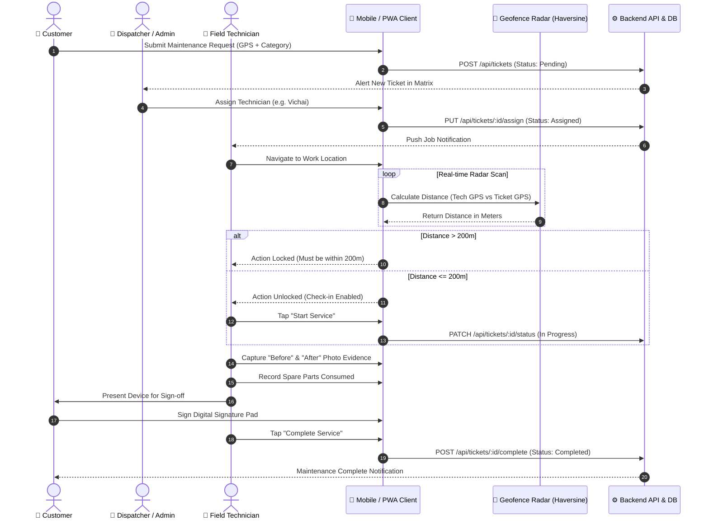

# FieldOps Nexus — Enterprise Field Service & Maintenance Platform

[](https://github.com/ZillerDX/field-service-platform/actions/workflows/deploy-pages.yml)
[](https://github.com/ZillerDX/field-service-platform/actions/workflows/flutter-release.yml)


FieldOps Nexus is an enterprise-grade Field Service & Maintenance management platform engineered for real-time dispatching, automated GPS geofencing, multi-role field workflow orchestration, and offline-first field operations.

---

## 🌐 Live Demos & Direct Downloads

| Platform | Channel | Link |
| :--- | :--- | :--- |
| **PWA Web Client (Prototype)** | GitHub Pages | 👉 [**https://zillerdx.github.io/field-service-platform/**](https://zillerdx.github.io/field-service-platform/) |
| **Android Production App** | GitHub Releases | 📥 [**Direct Download Release APK (Split-per-ABI)**](https://github.com/ZillerDX/field-service-platform/releases/latest) |
| **Backend API Gateway** | Local Docker | `http://localhost:5001/api` |

---

## 🏗️ System Architecture & Engineering Standard

FieldOps Nexus is designed with a hybrid dual-channel architecture:
1. **Offline-Capable Progressive Web App (PWA)**: Built with zero build step overhead, relative asset mapping (`./`), dual desktop/mobile responsive engines, and Cache-First Service Workers for uninterrupted offline usability.
2. **Production Flutter Mobile Application**: Implemented in Flutter 3.x following strict **Clean Architecture** and the **BLoC (Business Logic Component)** pattern, featuring automated Haversine geofence verification ($\le 200\text{m}$), evidence collection, and digital signature sign-off.
3. **Containerized Micro-Backend**: Node.js, Express, TypeScript, and MongoDB 7 running with Docker Compose, secured by JWT Bearer tokens and Geospatial indexes (`2dsphere`).

### Clean Architecture Blueprint (Flutter Mobile)

```
mobile/lib/
├── core/
│   ├── constants/       # API endpoints, geofence radius (200m), timeouts
│   ├── network/         # Dio HTTP client with JWT Bearer Interceptor & retry
│   ├── theme/           # Midnight Obsidian visual design system
│   └── utils/           # Haversine geofence calculator & SharedPreferences cache
├── features/
│   ├── auth/            # JWT authentication, session storage, AuthBloc
│   ├── tickets/         # Ticket CRUD, GPS tagging, customer portal, TicketBloc
│   ├── technician/      # Geofence Radar, job execution, photo evidence, signature pad
│   └── dispatcher/      # Triage table, technician assignment matrix
└── routes/              # GoRouter with role-based auth redirect guards
```

---

## 🔄 End-to-End Workflow (Swimlane Sequence Diagram)



---

## 📁 Repository Directory Structure

```
field-service-platform/
├── .github/
│   └── workflows/
│       ├── deploy-pages.yml      # Automated GitHub Pages PWA deployment
│       └── flutter-release.yml   # Flutter test, analyze & split-ABI APK release
├── backend/                      # Node.js + TypeScript + MongoDB backend
│   ├── public/                   # PWA web client assets
│   │   ├── icons/                # PWA icons (192x192, 512x512, maskable)
│   │   ├── index.html            # Remediated PWA application
│   │   ├── manifest.json         # PWA web application manifest
│   │   └── sw.js                 # Service worker with Cache-First strategy
│   ├── src/                      # Controllers, models, middleware, services
│   ├── Dockerfile
│   └── package.json
├── docs/                         # Mirror of public/ for GitHub Pages root
├── mobile/                       # Production Flutter mobile application
│   ├── android/                  # Native Android configuration & permissions
│   ├── lib/                      # Clean Architecture implementation (BLoC)
│   ├── test/                     # Geofence & widget unit test suite
│   ├── pubspec.yaml              # Dependencies & asset configuration
│   └── analysis_options.yaml     # Strict Flutter lint rules
├── docker-compose.yml            # Multi-container local orchestration
└── README.md
```

---

## 🚀 Local Development Setup

### 1. Prerequisites
- [Docker & Docker Compose](https://www.docker.com/)
- [Node.js](https://nodejs.org/) v20+
- [Flutter SDK](https://flutter.dev/) v3.24+

### 2. Launch Backend & MongoDB
```bash
# Clone the repository
git clone https://github.com/ZillerDX/field-service-platform.git
cd field-service-platform

# Start MongoDB and Backend via Docker
docker-compose up -d --build

# Verify services are running
docker ps
```
The Backend API will be available at `http://localhost:5001/api` and the local PWA will be live at `http://localhost:5001`.

### 3. Launch Flutter Mobile Application
```bash
cd mobile

# Fetch dependencies
flutter pub get

# Run unit tests
flutter test

# Launch on connected device or emulator
flutter run
```

---

## 🔑 Demo Access Credentials

| Role | Username | Password | Direct View |
| :--- | :--- | :--- | :--- |
| **Field Technician** | `tech_vichai` | `password123` | Radar Geofence, Evidence, Parts, Sign-off |
| **Dispatcher / Admin** | `admin` | `password123` | Dispatch Matrix, Tech Assignment |
| **Customer** | `customer1` | `password123` | Ticket Creation, GPS Picker, Status Tracker |

---

## 📡 API Reference Matrix

| Method | Endpoint | Access | Description |
| :--- | :--- | :--- | :--- |
| `POST` | `/api/auth/login` | Public | Authenticate user & return JWT Bearer Token |
| `GET` | `/api/tickets` | Protected | Retrieve ticket feed (filtered by role) |
| `POST` | `/api/tickets` | Customer / Admin | Create new maintenance ticket with GPS coordinates |
| `PUT` | `/api/tickets/:id/assign` | Admin / Dispatcher | Assign ticket to a field technician |
| `PATCH` | `/api/tickets/:id/status` | Technician / Admin | Update status (`In Progress`, `Completed`) |
| `POST` | `/api/tickets/:id/complete` | Technician | Submit job completion report (evidence + parts + signature) |

---

## 📄 License
This project is licensed under the MIT License - see the [LICENSE](LICENSE) file for details.
